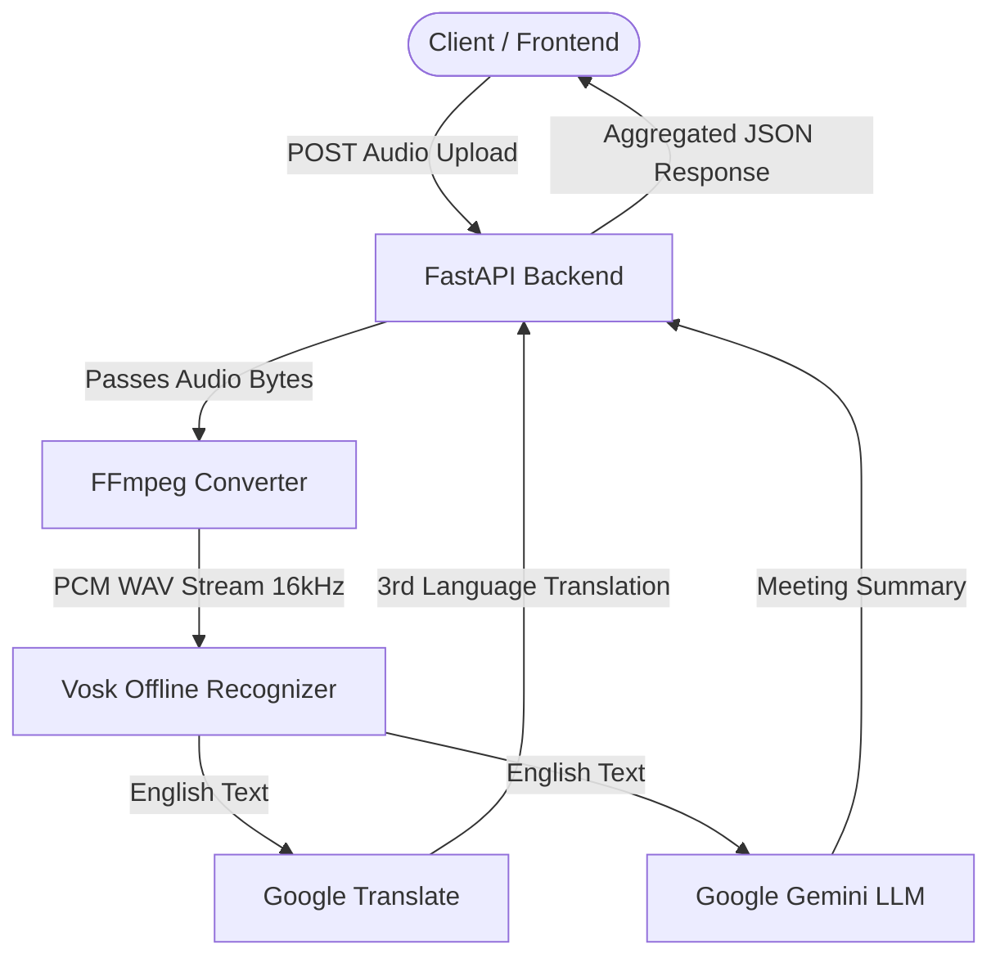

# 🎙️ Shulker AI - Speech Recognition & Summarizer API
A modular, high-performance speech transcription, translation, and meeting summarization backend powered by FastAPI, Vosk offline recognition, Google Translate, and Google Gemini. The core AI speech engine of the Shulker meeting assistant.

💡 **Made by [Vasu Goel](https://github.com/vasug27)**

---

## ✅ Overview & Key Features

Shulker AI is a production-ready **FastAPI backend** designed to handle local offline transcription, real-time translations, and automated AI meeting summaries.

### 🌟 Core Features
- **⚡ Fast Async Framework:** Upgraded from Flask to FastAPI for faster request processing and low-latency performance.
- **🎙️ Offline Speech-to-Text:** Instant English transcription using **Vosk** (zero API costs, running completely offline).
- **🌐 Real-Time Translation:** Automatically translates English transcriptions to Hindi using Google Translate.
- **🧠 Generative Meeting Summaries:** Leverages Google Gemini (`gemini-flash-latest`) to output structured summaries containing action items and key decisions.
- **🔄 Audio Format Independence:** Uses an internal **FFmpeg** pipeline to decode and convert any incoming audio file format (MP3, WAV, WebM, M4A, OGG) to single-channel PCM on the fly.
- **🛡️ External Client CORS:** Built-in FastAPI `CORSMiddleware` configured to allow external cross-origin requests.

---

## 🛠️ Architecture Design

The backend processes incoming audio files and generates transcriptions, translations, and summaries using the following execution path:



---

## 🛠 Tech Stack

| Category            | Technologies Used |
|---------------------|--------------------|
| Framework           | FastAPI, Uvicorn |
| Speech Recognition  | Vosk 0.3.45 (`vosk-model-small-en-us-0.15`) |
| Audio Conversion    | FFmpeg, Wave, KaldiRecognizer |
| Translation         | googletrans 4.0.0-rc1 |
| AI Summarization    | Google Generative AI ( `gemini-flash-latest`) |
| Package Management  | python-multipart, python-dotenv |
| Containerization    | Docker (python:3.12.4-slim) |
| Deployment Platform | Render (Docker Web Service) |

---

## 🧠 Key System Components

*   **FastAPI Application:** Serves as the high-concurrency API server handling file uploads, managing routing logic, and standardizing error/success responses.
*   **FFmpeg Pipeline:** A background subprocess that reads files from input streams, normalizes sample rates to 16000Hz, merges stereo channels into mono, and outputs standard `pcm_s16le` bytes.
*   **Vosk Recognition Engine:** An offline Kaldi-based library that performs local speech-to-text without sending private data to external networks.
*   **Google Gemini Generator:** Generates structured Markdown-style meeting summaries containing a high-level summary paragraph and numbered action items.

---

## 📁 Folder Structure

```
├── .gitignore
├── .env
├── README.md
├── requirements.txt
├── dockerfile                 # Docker configuration file
├── render.yaml                # Render service deploy blueprint
├── runtime.txt                # Target python version
├── api.py                     # Main FastAPI application and routing logic
├── test_meeting.mp3           # Generated sample audio for manual testing
└── vosk-model-small-en-us-0.15/    # Offline speech recognition model
    ├── am/                    # Acoustic model
    ├── graph/                 # Language graph (FST)
    ├── ivector/               # Speaker adaptation vectors
    └── conf/                  # MFCC model parameters config
```

---

## ⚙️ Setup & Credentials Guide

### 1️⃣ Google AI Studio (Gemini Key)
1. Go to [Google AI Studio](https://aistudio.google.com/).
2. Generate an API Key and add it to your `.env` as `GEMINI_API_KEY`.

### 2️⃣ Install FFmpeg
The backend uses FFmpeg for audio decoding. Make sure it is installed and added to your system `PATH`:
* **Windows (via Winget):**
  ```powershell
  winget install --id=Gyan.FFmpeg
  ```
* **macOS (via Homebrew):**
  ```bash
  brew install ffmpeg
  ```
* **Linux (apt-get):**
  ```bash
  sudo apt-get install ffmpeg
  ```

### 3️⃣ Local Deployment
```bash
# Clone the repository
git clone https://github.com/vasug27/Shulker_AI.git
cd Shulker_AI

# Setup virtual environment
python -m venv venv
.\venv\Scripts\activate      # Windows Powershell (or source venv/bin/activate on macOS/Linux)

# Install dependencies
pip install -r requirements.txt

# Start the FastAPI server
python api.py
```
The server will start running on **[http://localhost:5000](http://localhost:5000)**.
* **Interactive API playground:** Go to [http://localhost:5000/docs](http://localhost:5000/docs) to test endpoints inside the browser.

### 4️⃣ Docker Deployment
```bash
# Build the Docker image
docker build -t shulker-ai .

# Run the container locally
docker run -p 5000:5000 --env-file .env shulker-ai
```

---

## 📌 Backend API Routes

| Method | Endpoint | Description |
|--------|----------|-------------|
| **GET** | `/` | Welcoming message and list of endpoints |
| **GET** | `/docs` | Interactive Swagger UI documentation |
| **POST** | `/recognize` | Converts file format, transcribes to English, translates to Hindi |
| **POST** | `/summarize` | Accepts raw text body and generates Gemini meeting summaries |
| **POST** | `/recognize-and-summarize` | Transcribes audio files and returns summaries in a single step |

---

## 🚀 Usage Guide & Sample Inputs

### 1. Test Status (GET `/`)
```bash
curl http://localhost:5000/
```
**Expected Response:**
```json
{
  "message": "Optimized Speech + Summarizer API running!",
  "routes": ["/recognize", "/summarize", "/recognize-and-summarize"]
}
```

### 2. Auto-Translate & Transcribe (POST `/recognize`)
Upload an audio file (MP3, WAV, M4A, etc.) to get an English transcript and translation.
```bash
curl -X POST -F "file=@test_meeting.mp3" http://localhost:5000/recognize
```

### 3. Summarize Transcript (POST `/summarize`)
Send a plain text transcript in the request body to generate structured summary bullet points.
```bash
curl -X POST -H "Content-Type: text/plain" -d "hello how are you? we can start the meeting. thank you" http://localhost:5000/summarize
```

---

## 🔐 Environment Variables (`.env`)

Create a `.env` file in the root folder of the project with the following:

```ini
GEMINI_API_KEY=your_google_gemini_api_key_here
```

---

## 🎙️ Vosk Model Details

This repository includes a lightweight offline English speech recognition model (`vosk-model-small-en-us-0.15`).

| Attribute | Specification |
|---|---|
| Size | 40 MB (mobile and edge optimized) |
| Sample Rate | 16000 Hz (mono) |
| Word Error Rate | 10.38% (TED-LIUM) |
| Processing Latency | ~0.15 seconds |

---


## 🧑 Author

**Vasu Goel**

[](mailto:vasugoel2754@gmail.com)
[](https://www.linkedin.com/in/vasugoel503/)
[](https://github.com/vasug27)

---

*Built for Shulker (AI Video Conferencing Assistant). Extension microservice for Quiz Generation resides at [Shulker RAG](https://github.com/Shulker-000/Shulker_RAG).*